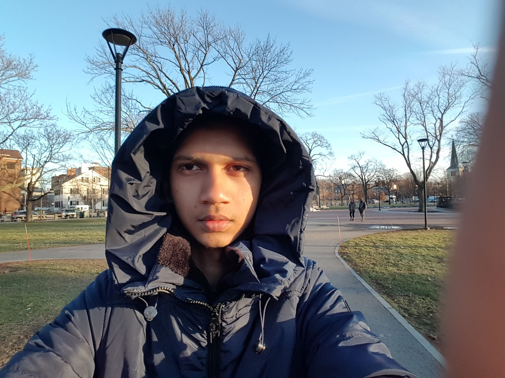
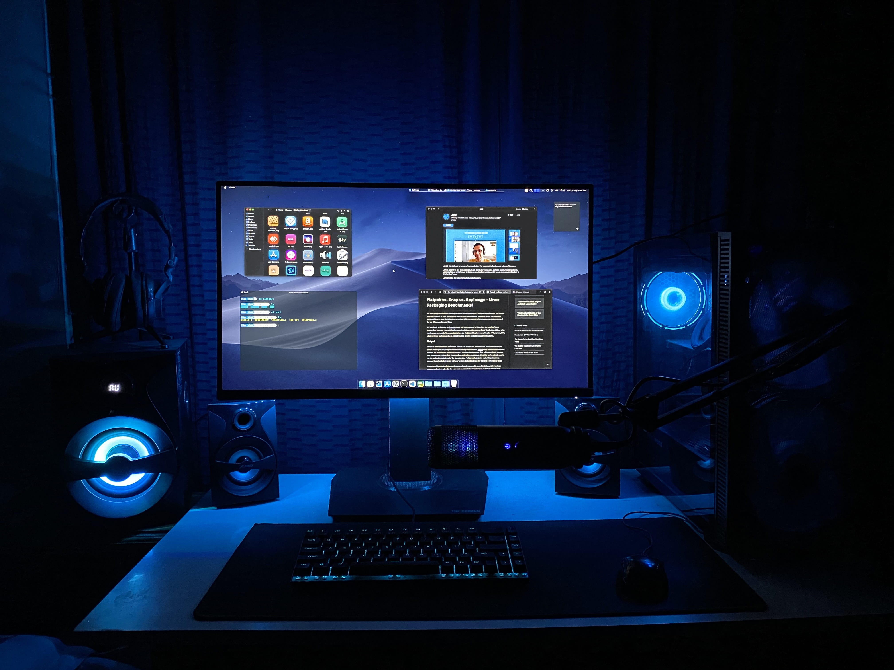
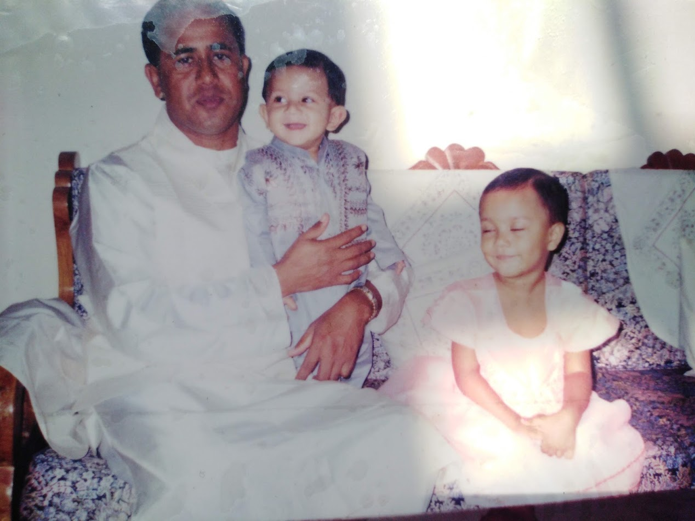
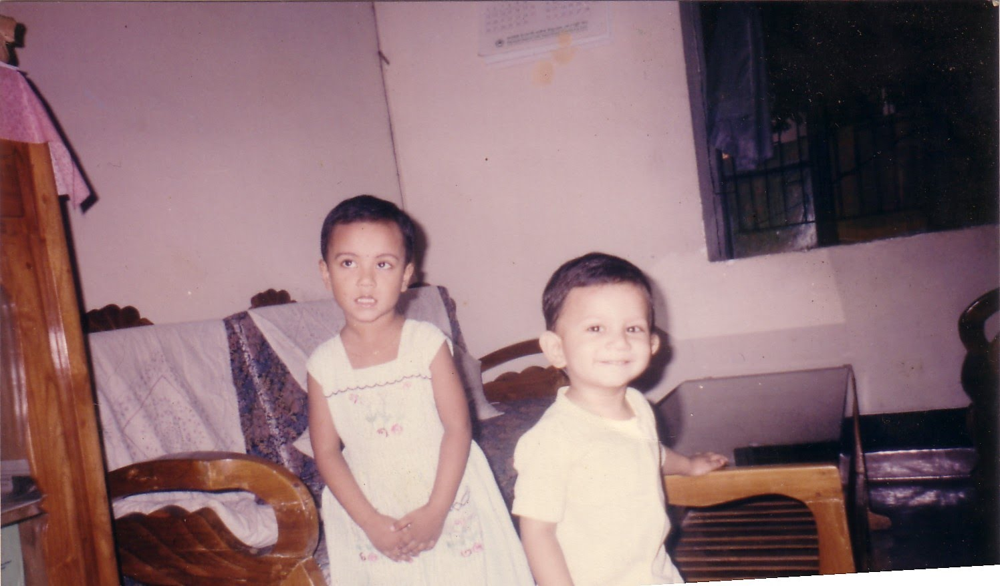
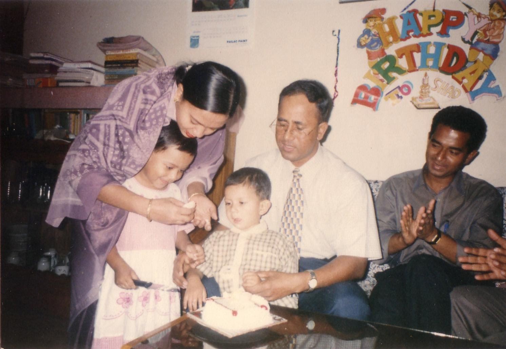
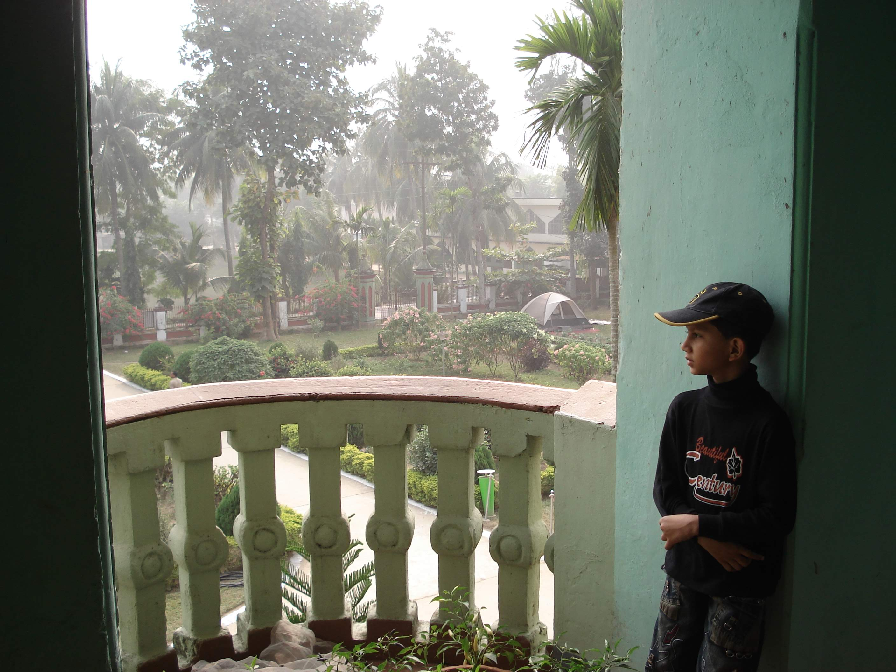

# Ashikur Rahman Shad [(arstrx)](https://arstrx.com)

December 2019 at Harvard University, USA

^-^

## About Me

✨️

### Short Bio:

Muslim Bangladeshi

I am a programming and tech enthusiast. I've been coding since 6th Grade. 

I also make beats 🎹️🎶️

I love all forms of arts

**Believer in Free Software**  *GNU, Linux, KDE,  Mozilla ❤*

**Interests:** History, Philosphy, Religion, Psychology,  Ideology, Cars, Tech

&nbsp;

### Favorites:

**Timepass:** Music, Anime, Gaming,

**Productive Timepass:** Coding, Making Beats

I love all forms of arts, either be a painting, music, poetry, or a UI Design😅

**Food:** Pizza, Ice Cream.

**Anime:** Naruto *(Favorite Charecters: Obito, Kabuto, Kimimaro)*

**My Spotify Playlists** : [EDM](https://open.spotify.com/playlist/6ZwDWx4c9MLQvyNegzddv7?si=a0fb32cbb4374b7e),
[Favorite Songs (Indian)](https://open.spotify.com/playlist/3r6Tn6Yl7soX4dRYX3Qz7a?si=3d2b8fb4316245eb)

&nbsp; 
### Programming skills 🖥️:

>**User Interface / Front-end**:  HTML5, CSS, JS

>**Server Side**: PHP, JS

>**App Development**: JS, Java, Python, C++, 

**Problem Solving**: [BeeCrowd *(URI)*](https://www.beecrowd.com.br/judge/en/profile/598716)

&nbsp; 
### Academics 👨‍🎓️:

Currently I'm completing **B.Sc in Software Engineering** at **Daffodil International University**

>#### Past
>
>**SSC-2018** *(BIAM Model School And College)*
>
>**HSC-2020**

&nbsp; 

## Gallary

&nbsp;

#### My Setup

 Blue Setup with Dark theme

&nbsp;

#### My childhood

Shad with dad and sister!

Eid day with sister!

another photo with sister!!

Evergreen smiling me!

My Birthday woohoo!

&nbsp; 

#### Growing Shad

Balcony and the breeze!

&nbsp; 

#### Now ✨

At Cox's Bazar!
